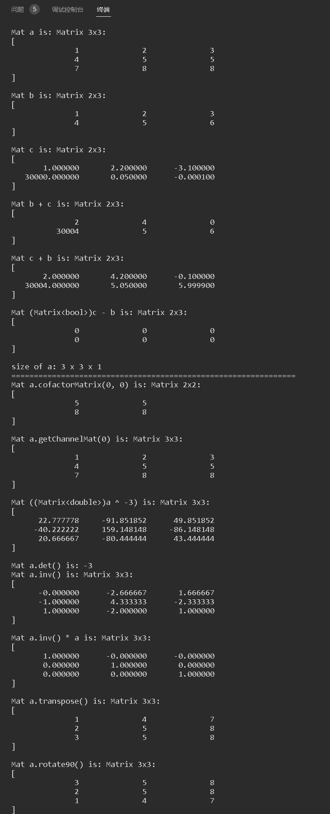

# CS205 C/C++ Programming - 2022 Fall - Projects: Matrix Calculator

**Name:** Yuanji Zhong

**SID:** 12012613 (Sourthern University of Science and Technoledge)

See Chinese version at [README-CN.md](./README-CN.md)

## 1. Projects

There are totally 5 projects in Fall 2022:

|        Project         |                   Project Introduction                   | Number of Files |
| :--------------------: | :----------------------------------------------------------: | :------: |
| [Project1](./Project1) | Implement a two-digit (integer or floating-point) number multiplication calculator that passes arguments through the command line  |    1     |
| [Project2](./Project2) | Implement a calculator that supports addition, subtraction, multiplication, division, remainder, multiplication, parentheses, rounding, trigonometric function, logarithm and other mathematical calculations, as well as parameter assignment and call |    6     |
| [Project3](./Project3) | A matrix structure supporting addition, subtraction, multiplication, number multiplication, determinant, inverse and other operations is realized only through C language |    5     |
| [Project4](./Project4) | Improve the matrix multiplication part of matrix structure in project 3 and realize the generation of random matrix only through C language |    6     |
| [Project5](./Project5) | Establish different data formats, support the number of rows and channels matrix class, matrix soft copy and hard copy memory management, to achieve operator overloading and matrix type conversion only through C++ language |    5    |

[GUI_CMD](./GUI_CMD) Is an interactive file manager, Support: Run files/instructions (absolute path), new folders, new files,
rename files (folders), compile and run c++ files and delete executable files (multiple files from the second please enter the absolute path),
view files, write files, edit files, copy files (folders), move files (folders), delete folders, delete files, Compatible with Windows and Linux through macro definition.

## 2. Code running

For the project with only one code file, please use command lines to compile and run it. For example in Project 1:

```bash
g++ source.cpp -o mul & mul 1 2
```

For the project with more than one code file, please use 'cmake' or 'make' to compile and run it. For example in Project 2:

```bash
cmake . & make
./Project2.out
```

## 3. Report and examples (in Chinese)

In the third part of the program report 'report.pdf' (or 'porject{i}.md') file, more examples are generally given, and the correctness of the attached drawings and programs can be verified by running the code.

## 4. Snapshot



